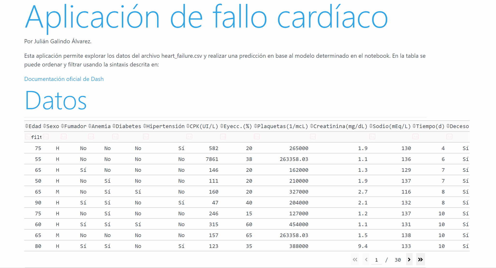
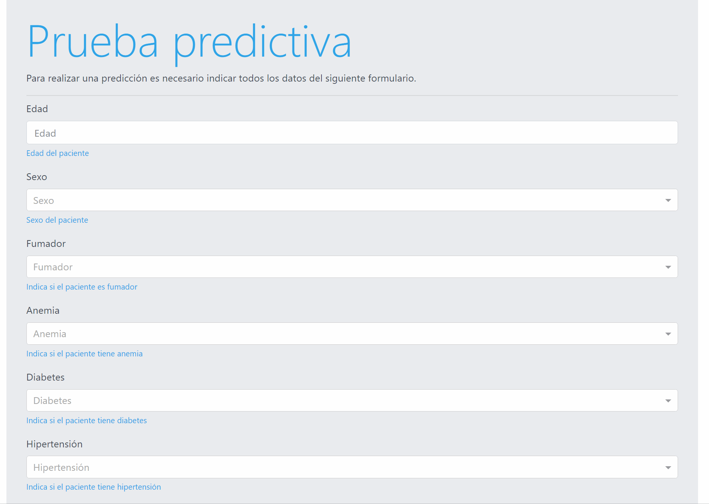

# Heart-failure
Análisis y modelado predictivo del fallecimiento de pacientes en base a distintas biométricas usando el dataset heart_failure.csv desarrollado en python. Se dispone de una [Dash app](https://plotly.com/dash/) con una interfaz gráfica simple para usar el modelo.

## Instalación local

Se recomienda crear un entorno virtual en el directorio raíz. Para ello debemos ejecutar el siguiente comando:

```
python -m venv /path/to/new/virtual/environment
```

Para activar el entorno es necesario ejecutar alguno de los archivos *activate* del directorio *Script* generado. Como esto depende del sistema operativo, recomiendo consultar la documentación oficial de [venv](https://docs.python.org/3/library/venv.html).

Para instalar las dependencias de este proyecto, necesitarás tener instalado pip en tu sistema. Si no tiene pip, puede instalarlo siguiendo las instrucciones [aquí](https://pip.pypa.io/en/stable/installation/).

Una vez que tenga pip instalado, en el directorio raíz del proyecto donde se encuentra `requirements.txt` ejecute el siguiente comando:

```
pip install -r requirements.txt
```

Esto instalará todas las dependencias listadas en el archivo `requirements.txt`.

## Exploración, análisis y modelado

El conjunto de datos se encuentra en el archivo *heart_failure.csv* en el directorio **data**

* En el cuaderno de jupyter [heart_failure.ipynb](heart_failure.ipynb) se desarrolla la exploración y análisis del dataset así como la selección de un modelo para la variable objetivo *DEATH_FAILURE*.
* El archivo [heart_fialure_stat_report.html](heart_fialure_stat_report.html) se genera en el notebook y ofrece un report estadístico del dataset generado con la herramienta [*pandas profiling*](https://pandas-profiling.ydata.ai/docs/master/index.html).

En el notebook se comparan distintos modelos y se obtiene el que mejor resultado da para nuestro objetivo. Los parámetros del modelo se guardan en el directorio **model** para luego poder ser usado en la app. Además, distintos elementos de configuración se encuentran parametrizados en el archivo *config.yaml*.

## Aplicación con UI

La aplicación disponible permite explorar el dataset filtrando y ordenando los distintos datos. Además dispone de un formulario que permite realizar una predicción en base al modelo determinado.

<p align="center">
 
<p>

<p align="center">
 
<p>

Para iniciar la aplicación basta con ejecutar el siguiente comando desde la raíz:

```
python .\app\main.py
```

Para cambiar el puerto en el que se despliega la aplicación, es necesario ir al archivo *config.yaml* y modificar el campo PORT.
